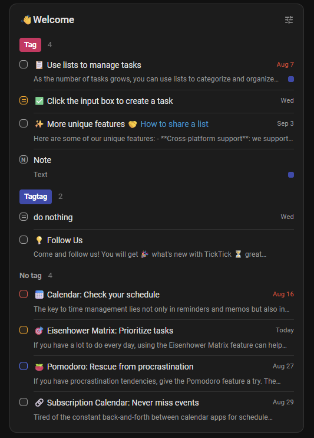

# Home Assistant TickTick Integration

Integration implements [TickTick Open API](https://developer.ticktick.com/docs#/openapi) with support for [To-do list](https://www.home-assistant.io/integrations/todo/) entities and exposes it as services in Home Assistant, allowing you to manage your tasks and projects programmatically.

This is a fork of [Hantick/ticktick-home-assistant](https://github.com/Hantick/ticktick-home-assistant) by [Hantick](https://github.com/Hantick), maintained by [Mo7t0n](https://github.com/Mo7t0n) with note lists as sensors and a custom `ticktick-list-card` Lovelace card.

## Installation

1. Navigate to [TickTick Developer](https://developer.ticktick.com/manage) and click `New App`
2. Name your app and set `OAuth redirect URL` to `https://my.home-assistant.io/redirect/oauth` or your instance url i.e `http://homeassistant.local:8123`
3. Add this repository in HACS and download TickTick Integration via HACS
4. In Settings → Devices & services, use the dotted menu to create new application credentials (`/config/application_credentials`). Enter the OAuth client ID and secret from the TickTick app here.
5. Your TickTick task lists now turn up as todo lists, and every list (task lists and note lists alike) as a `sensor` entity in Home Assistant.

## Features

- **Lists as sensors** — every TickTick list (task or note) gets a `sensor` entity with the item count as state and the full list content (title, due date, priority, tags, checklist items, ...) as the `items` attribute, usable in templates/automations.
- **Dashboard card** — bundled `ticktick-list-card` Lovelace card that renders a list like the TickTick app, with due-date grouping, sorting, filtering, and checklist support.

  

  ```yaml
  type: custom:ticktick-list-card
  entity: sensor.__name__
  ```

- **Configurable sync interval** — polls TickTick once a minute by default; adjustable under Settings → Devices & services → TickTick → **Configure**.

## Exposed Services

- **Task**: Get, Create, Update, Delete, Complete Task, Complete Checklist Item (sub-task)
- **Project**: Get (Create, Update, Delete not yet supported)
